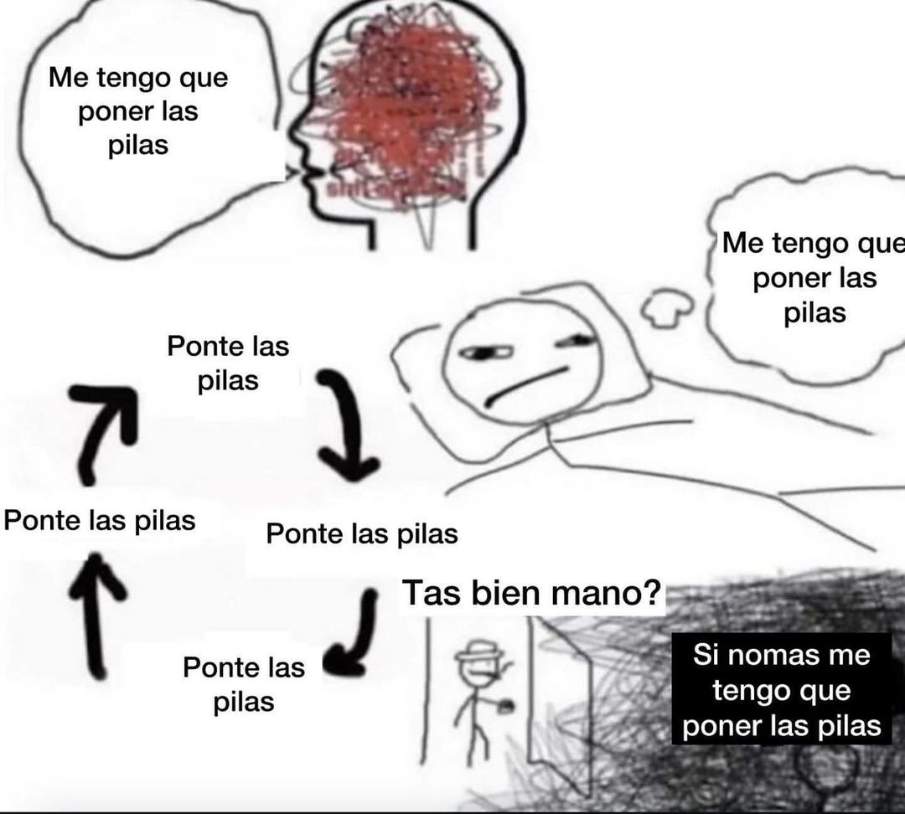

# Ejercicio_Markdown
Jugueteando con Markdown *by* __Fabián Alcaide López__

* ### 1. Imagen externa
**Side Eye Horse**  

* ### 2. Imagen interna
*Mano, tengo que ponerme las pilas*  

### 3. Enlace a nuevo documento
_[Enlace a nuevo_markdown](./nuevo_markdown.md)_

> Tengo que ponerme las pilas.